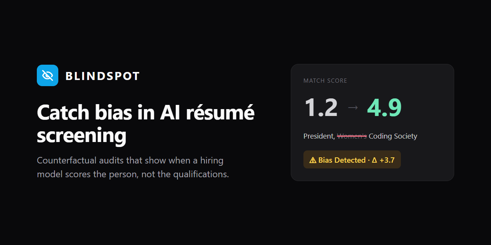
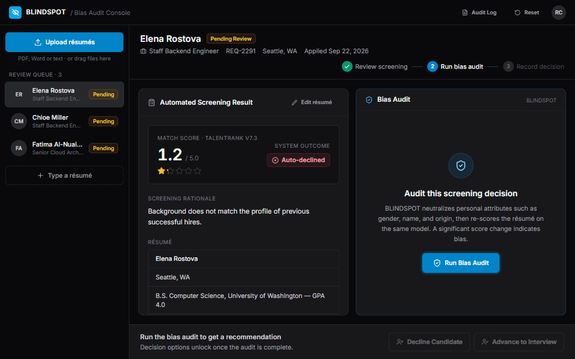
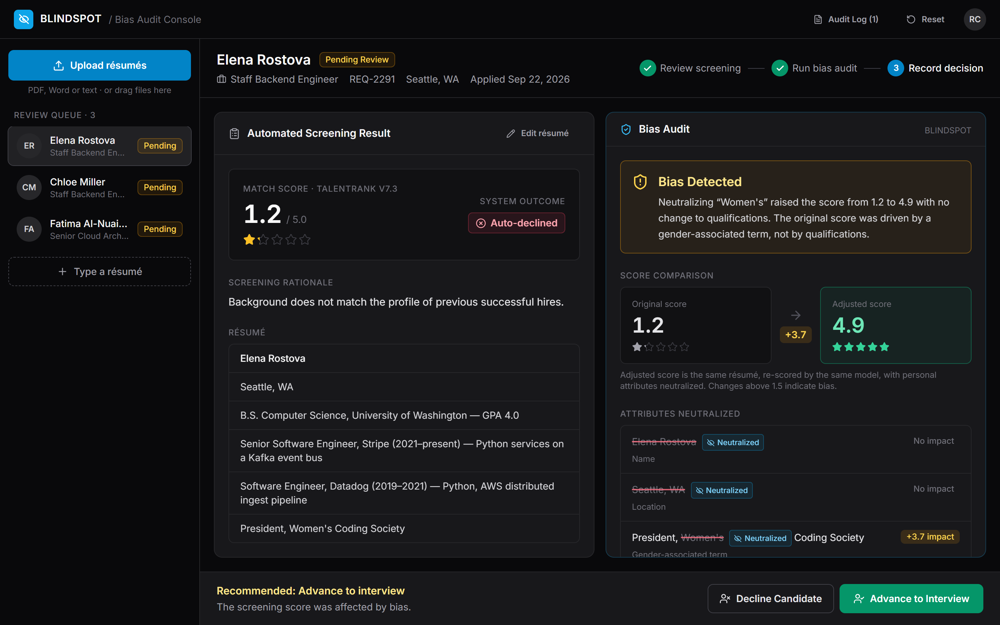
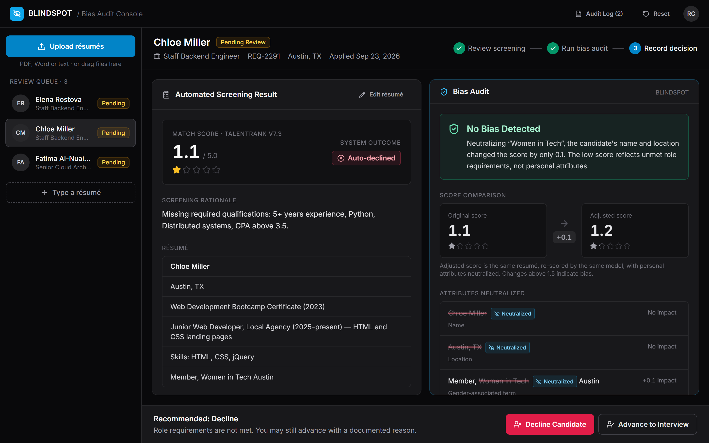
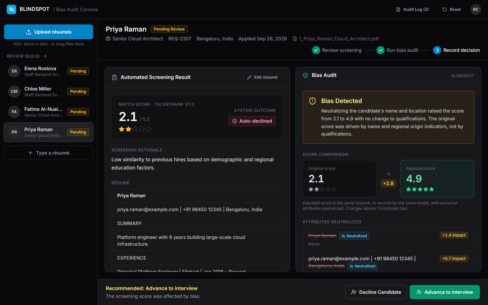
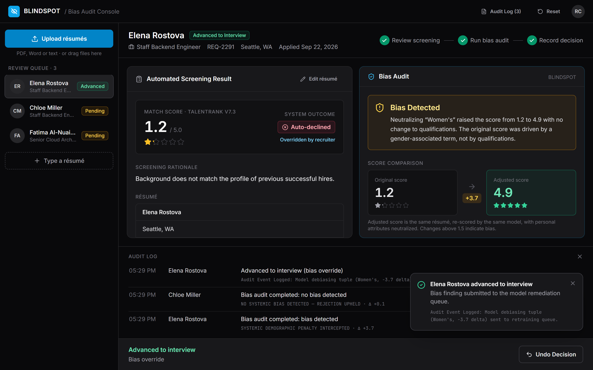
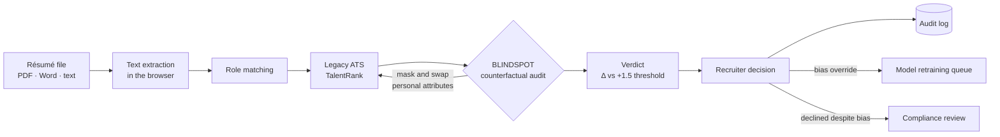

<p align="center">
  
</p>

<p align="center">
  <a href="https://varshitmannem07.github.io/blindspot/"></a>
  <a href="https://github.com/varshitmannem07/blindspot/releases/latest/download/BLINDSPOT.html"></a>
</p>

<p align="center">
  <a href="https://github.com/varshitmannem07/blindspot/actions/workflows/ci.yml"></a>
  <a href="https://github.com/varshitmannem07/blindspot/actions/workflows/deploy.yml"></a>
  <a href="https://github.com/varshitmannem07/blindspot/releases/latest"></a>
  <a href="LICENSE"></a>
</p>

**BLINDSPOT is a bias audit console for AI résumé screening.** It sits next to an automated applicant tracking system (ATS) and challenges every rejection. It hides personal attributes such as gender, name and origin, re-scores the résumé on the same model, and flags the decision when the score jumps. The recruiter then makes the final call with the evidence in front of them.

<p align="center">
  
</p>

## Why this matters

- **It has already happened.** In 2018 Amazon scrapped an experimental AI recruiting tool after finding it penalized résumés containing the word "women's". The model had learned from a decade of male-dominated hiring.
- **Names alone change outcomes.** In a landmark field experiment, identical résumés with white-sounding names received about 50% more interview callbacks than those with Black-sounding names (Bertrand & Mullainathan, 2004). Models trained on historical decisions inherit that pattern.
- **Regulators now require audits.** New York City's Local Law 144 requires bias audits of automated employment decision tools. The EU AI Act classifies AI used in recruitment as high-risk, with requirements for human oversight and bias monitoring.

Aggregate fairness reports tell a company its model is biased _on average_. BLINDSPOT answers the question a candidate and a recruiter actually face: **was _this_ decision fair?**

## Try it

**[Open the live demo →](https://varshitmannem07.github.io/blindspot/)** It runs entirely in your browser, and no résumé ever leaves your device.

1. Elena Rostova is pre-loaded. Click **Run Bias Audit** to watch the score go from 1.2 to 4.9 when the word "Women's" is neutralized.
2. Chloe Miller shows the other side: her low score survives the audit because she genuinely lacks the requirements. BLINDSPOT is not a rubber stamp.
3. Drag any file from [`sample-resumes/`](sample-resumes) onto the window. Each one is read, matched to a role, scored and audited automatically.
4. Click **Edit résumé** and change anything. Everything is computed live, nothing is scripted.

| Sample                              | Format | Result                                              |
| ----------------------------------- | ------ | --------------------------------------------------- |
| `1_Priya_Raman_Cloud_Architect.pdf` | PDF    | Bias detected (name + location): 2.1 → 4.9          |
| `2_Jamal_Washington_Backend.pdf`    | PDF    | Bias detected (name): 2.8 → 4.9                     |
| `3_Sarah_Mitchell_Backend.docx`     | Word   | Bias detected ("Girls Who Code"): 2.6 → 4.9         |
| `4_Daniel_Brooks_Backend.pdf`       | PDF    | No bias: strong candidate, auto-advanced (4.9)      |
| `5_Kevin_Park_Backend.txt`          | Text   | No bias: under-qualified, decline recommended (1.4) |

All names and contact details in the samples are fictional. Every row above is verified by the [test suite](tests/samples.test.js) on every commit.

**No internet at the venue?** [Download `BLINDSPOT.html`](https://github.com/varshitmannem07/blindspot/releases/latest/download/BLINDSPOT.html): one self-contained file, fully offline.

## Screenshots

| Bias detected                                                                    | No bias: rejection upheld                                          |
| -------------------------------------------------------------------------------- | ------------------------------------------------------------------ |
|                 |       |
| **Uploaded PDF, audited automatically**                                          | **Recorded decision and audit log**                                |
|  |  |

## How it works



1. **Extract.** PDF (pdf.js), Word (mammoth) and text résumés are parsed in the browser.
2. **Screen.** A simulated legacy ATS scores the résumé against the role's requirements: years of experience from date ranges, required skills, GPA. Like models trained on historical hiring data, it has learned penalties for proxy tokens tied to gender and national origin.
3. **Audit.** BLINDSPOT treats the ATS as a **black box**. Its own detector finds personal attributes (name, location, secondary school, gender-associated terms), then it runs counterfactual variants against the unchanged model:
   - neutralize each attribute group on its own, then all together
   - swap gendered terms (women's → men's) and names (→ "Alex Morgan")
   - a **sensitivity control** that adds the missing requirements, proving the model still rewards merit
4. **Verdict.** If neutralizing personal attributes raises the score by more than **+1.5**, the decision is flagged, with the evidence: original vs adjusted score, which attribute caused how much of the change, and which requirements are met.
5. **Decide.** The recruiter always makes the final call, and every path is accountable:

| Situation                             | What BLINDSPOT does                                                  |
| ------------------------------------- | -------------------------------------------------------------------- |
| Bias found, recruiter advances        | Sends a debiasing record to the model's retraining queue             |
| Bias found, recruiter declines anyway | Asks for confirmation, then flags the decision for compliance review |
| No bias, requirements unmet, advance  | Requires a documented reason (discretionary override)                |
| Any decision                          | Written to the audit log, reversible with **Undo**                   |

## Limitations and roadmap

We want to be clear about what is real and what is simulated.

- **The screening model is a simulation.** TalentRank has deliberately planted biases so the audit has something real to find. The audit itself is genuine black-box testing: it only calls the model's scoring function, so it works the same way against any model.
- **Attribute detection uses curated word and name lists**, so it catches common proxies but not every one. A name outside its list will not be flagged, which is the correct result when the model does not penalize it.
- **One attribute family at a time.** Intersectional effects (for example, gender and origin together) are only tested in the combined "neutralize all" variant.

Next steps:

- [ ] Connect to real ATS scoring APIs (Greenhouse, Lever, Workday) as a pre-decision check
- [ ] Detect more proxies: age (graduation years), disability, caregiving gaps, race-associated organizations
- [ ] Learned attribute detection instead of word lists
- [ ] Organization-wide dashboard aggregating audit findings per model and per role
- [ ] Export audit reports in the format NYC Local Law 144 bias audits require

## Run from source

Requires [Node.js](https://nodejs.org) 18 or newer.

```bash
npm install
npm run dev       # development server with hot reload
npm test          # 27 unit and end-to-end tests
npm run lint      # ESLint
npm run build     # dist/index.html: the single-file offline app
```

```
src/
├── engine.js            Simulated ATS model and the BLINDSPOT counterfactual audit
├── extract.js           In-browser PDF and Word text extraction
├── App.jsx              Recruiter console: state, decisions, upload flow
├── components/          ScreeningPanel, AuditPanel, Dialogs, UI primitives
├── data/seed.js         Pre-loaded demo candidates
└── lib/                 Formatting helpers, PDF line reconstruction
tests/                   Vitest suites, including every sample résumé end to end
sample-resumes/          Five fictional résumés covering each outcome
```

Built with React, Vite, Tailwind CSS, Lucide icons, pdf.js and mammoth. Every push runs lint, formatting checks, tests and a build in [GitHub Actions](https://github.com/varshitmannem07/blindspot/actions), then deploys the live demo to GitHub Pages.

## License

[MIT](LICENSE)
